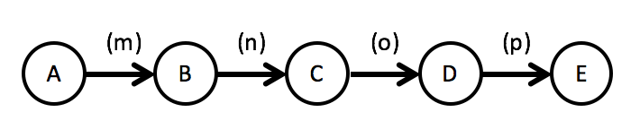
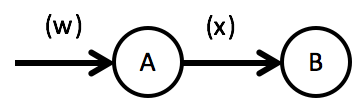
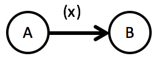
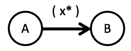

# 1-Dimensional Data Flows
A 1-dimensional data flow consists of a sequence of functional units (FU). It's a pipeline of arbitrary length:

Please be aware of that in such a data flow all FUs are working independently of each other, i.e. they can be active at the same time. Processor control can reside in several of them in parallel. In data flows what is flowing is data, not control. Sequence diagrams or flow charts are about control flow, Flow Design diagrams are about data flow.

But let that not alarm you! Although this is the fundamental nature of data flows it does not mean each and every data flow needs to be implemented using some multi-threading technology. Right to the contrary! Mostly data flows are so simple the "collapse into being" control control flows.

Since data flows are, well, about data it's only natural that Flow-Design offers specific conventions as to how to describe the data flowing:

|  	|   Explanation	|
|---	|---	|
|   	|   The simplest form of data flowing is when a single input data item *w* leads to the production of a single output data item *x*.	|
|   	|   Following all data flows will focus on the output. The input is assumed to be a single data item. So this image depicts the same as the one above.	|
|   	|   A FU may output several data items at once. Just separate them with a `,` within the brackets.	|
|   	|   If a FU produces a list of data items, a `*` is put after the data description. It means *once many of the same kind*. Since Flow-Design is supposed to be rough and quick you usually don't need to be more precise with regard to how such a collection of data items later on should be represented in code, whether to use an array, list, iterator etc.	|

