A 1-dimensional data flow consists of a sequence of functional units (FU). It's a pipeline of arbitrary length:

Please be aware that in such a data flow all FUs are working independently of each other, i.e. they can be active at the same time. Processor control can reside in several of them in parallel. In data flows what is flowing is data, not control. Sequence diagrams or flow charts are about control flow, Flow Design diagrams are about data flow.

But let that not alarm you! Although this is the fundamental nature of data flows it does not mean each and every data flow needs to be implemented using some multi-threading technology. Right to the contrary! Most data flows are so simple they "collapse into" being control control flows.

Since data flows are, well, about data it's only natural that Flow-Design offers specific conventions as to how to describe the data flowing:

|  	|   Explanation	|
|---	|---	|
|      	|   The simplest form of data flowing is when a single input data item *w* leads to the production of a single output data item *x*. (See second diagram is an abbreviation of the first with a focus on the output data.)	|
|   	|   A FU may output several data items at once. Just separate them with a `,` within the brackets.	|
|   	|   If a FU produces a *list* of data items, a `*` is put after the data description. It means *once many of the same kind*. Since Flow-Design is supposed to be rough and quick you usually don't need to be more precise with regard to how such a *collection* of data items later on will be represented in code, whether to use an array, list, iterator etc.	|
|   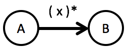	|   A FU may also output several data items per input data item. That's called a *stream*. A stream can consist of 1, many, or even 0 data items. It's denoted by putting a `*` outside and after the brackets. (That's one of the reasons why you should always put brackets around the data flowing.)	|

It's important you understand the difference between a *collection* and a *stream* of data items flowing out of a FU. With a *collection* the FU always procudes data: the *collection* itself. Even if the *collection* is empty there is some output.

That's different with *streams*. If a FU produces data items in a *stream* there really might be no data item at all flowing out of it.

*Collections* should be the default for you if a FU is supposed to produce several data items at once. They are easier to translate into program code. However, *streams* come in handy when the number of data items is not known in advance or is very large. They allow downstream processing to start while not all data items have been produced. Also *streams* are used where a FU has several outputs which alternatively produce output.

If you want to be more precise in describing streamed output you can use different types of brackets around the data:

|  	|   Explanation	|
|---	|---	|
|   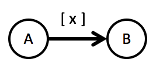 	|   Use `[]`  if 0 or 1 data items are streamed.	|
|   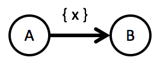 	|   Use `{}`  if 0 or many data items are streamed.	|
|   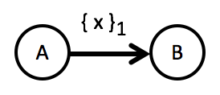 	|   Use `{}` with a suffix if *n* or any number larger than *n* data items are streamed.	|

Of course the symbols can be combined:

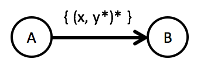

This means:

> A stream of 0 or more data items is flowing, `{}`. Each data items is a list of tuples, `(...)*`. And each tuple consists of two elements, *x* and a collection of *y* values, `y*`.

## Starting/Ending a Flow
|  	|   Explanation	|
|---	|---	|
|   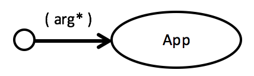 	|   Make starting a flow explicit by letting data flow "from the outside" into the first functional unit.	|
|   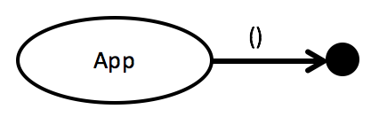 	|   Flows can end by letting data seep away in the final functional unit, maybe because it writes it to some resource. But if you like connect the final FU explicitly to the "outside".	|

## Factories
|  	|   Explanation	|
|---	|---	|
|   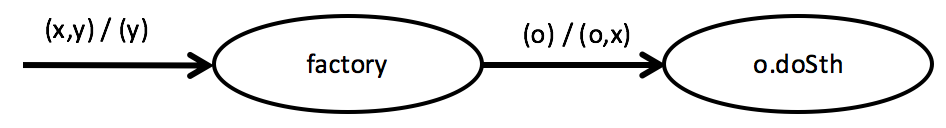 	|   A factory produces a functional unit to be used downstream. See how the output of `factory` is used for the `doSth` processing step.	|
|   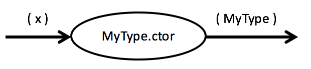 	|   A constructor is a valid translation of a functional unit. You can use it in your flows as a factory.	|

## Iteration
Data flows are declarative descriptions of solutions. They lack control structures like loops. And this should not be compensated by introducing circular flows! Rather make function units "collection-oriented": don't let single items flow, but collections. This is a marked difference between the usual "imperative thinking" and "flow thinking".

However, at the beginning when your're wrapping your head around Flow-Design it might seem difficult to see the handling of single data items behind the collection-oriented FUs.

This is a typical example of implicit iteration:

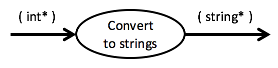

The flow focusses on a collection of integers being transformed into a collection of strings. Of course *within* `Convert to strings` there will be a loop at work. But that's not shown in the data flow.

Also, the loop is not really interesting. What's interesting is what's happening to each input data item. 

|  	|   Explanation	|
|---	|---	|
|   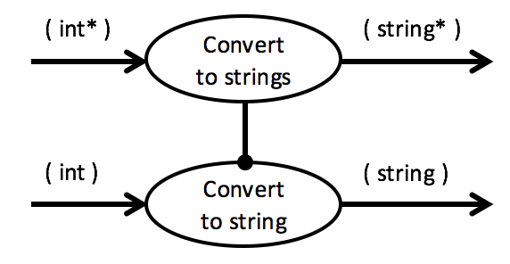 	|   If you want to make that very clear you can extract a single item FU and make the collection processing FU depend on it.	|
|   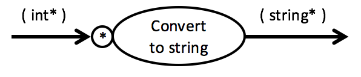 	|   Alternative emphasize collection processing by prefixing the FU with a `*` like this.	|

Making iteration explicit will help you in the beginning during translation of flow designs. Use it, when you have the feeling that processing single data items requires some effort.

