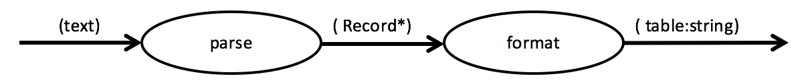
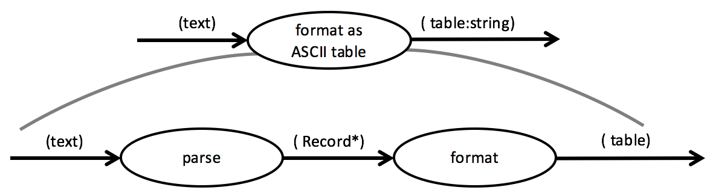
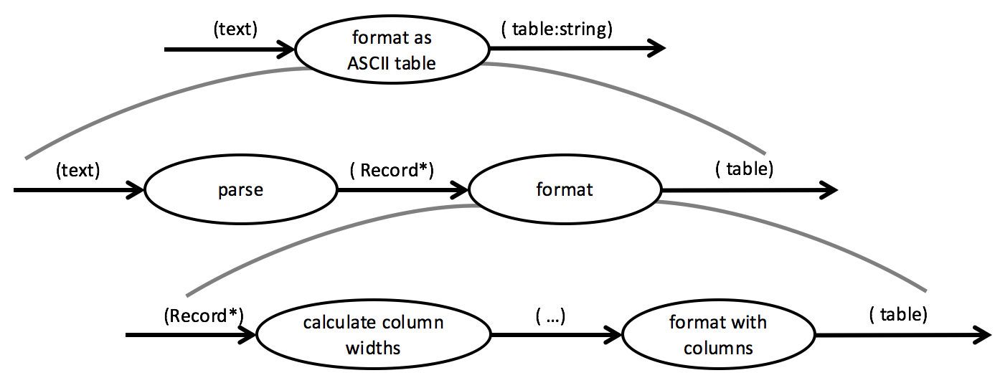

2-dimensional data flows are hierarchical data flows. When looking at a 1-dimensional data flow each processing step is taken as a black box. It's a transformation as described by its name, e.g.

In this example the first function unit (FU) parses data into records, and the second formats them as a table. How this is done it of no (immediate concern) when looking at this flow.

But what's the overall purpose of this flow? That can be expressed by an explicit *integration* in which the two FUs are nested:

The FU *format as ASCII table* is composed of the two former FUs.

This kind of bottom-up aggregation can of course be reversed into a top-down refinement. For example the *format* FU could be an integration as well composing a flow from two other FUs:

Flow designs can have an arbitrary nesting depth. Refine functional units as long as you deem necessary. The criteria to stop should be: a FU is easy to implement, its logic seems pretty obvious to you.

As you can see, data flows don't just extend from left to right (first dimension), but also from top to bottom (second dimension). This is to make them scalable means of describing solutions.

