A 3-dimensional data flow has more than one branch. It's not just a single sequence of functional units, but multiple potentially working in parallel.

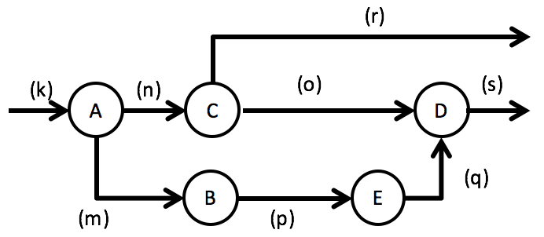

As this is a data flow not only could *A* and *C* be active at the same time. Also data could flow from *C* to *D* while simultaneously data flows from *B* to *E*.

With this dimension introduced a data flow can grow from left to right by putting functional units after one another. It can grow "in parallel" by forking into multiple branches. And it can grow "in depth" by refining functional units into ever more detailed nested data flows:

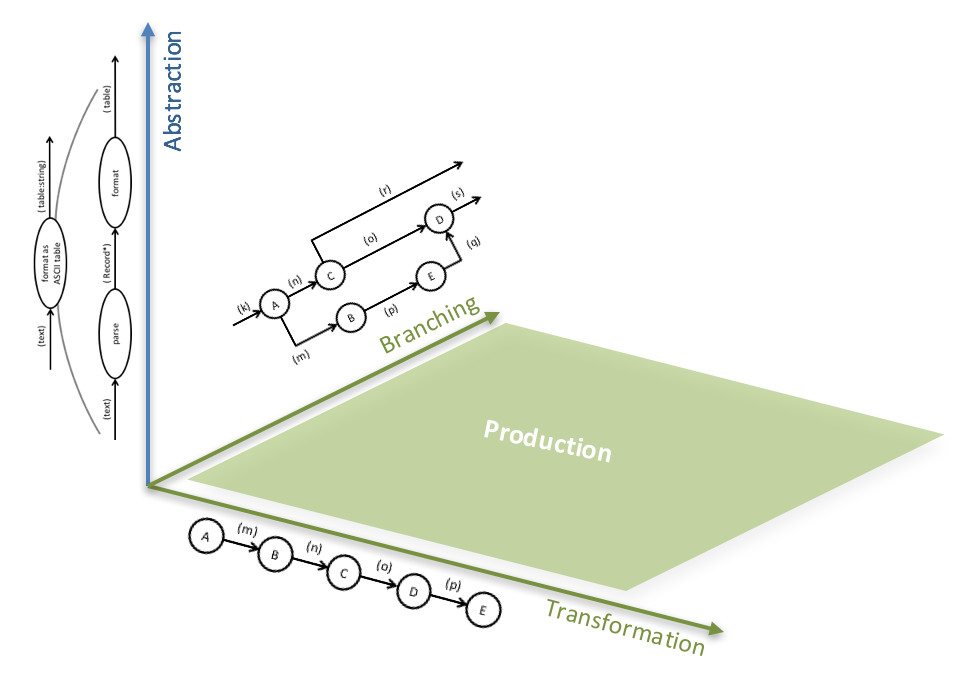

## Multiple Outputs
Branches in a 3D data flow can originate from any FU. A FU is not limited to one output. It can have as many as necessary to serve its purpose, e.g.

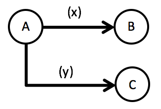

If that is the case, it sometimes is helpful to name the output *ports* like this:

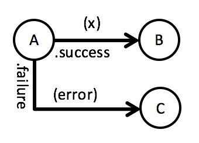

The port's label is a short description of the event which causes data to flow out on it.

If data is not produced on alternative ports for every input to the FU, you should make that clear by marking the outflowing data as streams:

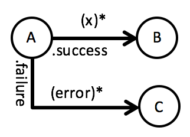

This later on helps when translating the data flow into code.

## Splitting
Branches do not need to originate from functional units, though. The can be created from a single flow by splitting:

|  	|   Explanation	|
|---	|---	|
|   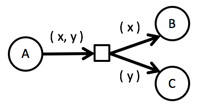   	|   An explicit *split* operation can take a data item and let its parts flow along different branches.	|
|   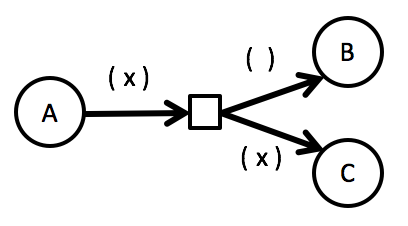   	|   Even a single value can be split into *empty data* (or a *signal*) flowing this way and the data the other way.	|
|   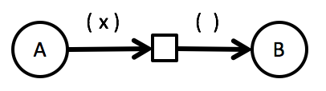   	|   Or maybe a value should be "gobbled up" by replacing it with just a *signal*.	|
|   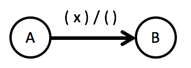   	|   Special convention to avoid a *split* operation. Switch from some output data to other input data by separating it with a `|` (or `/`).	|

The latter notation is very handy in flows where in a sequence not all function units operate on their immediate predecessors output, e.g.

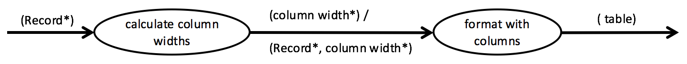 

The first FU produces a list of *column width* values. But that's not the input for the next FU. That operates on a list of *record*s *and* a list of *column width* values. The switch between output and input is done with a `|` inbetween.

Consider all data in a flow to live in a scope. As soon as data is produced upstream you can use it any place downstream. No need to direct it explicitly anywhere using branches. This considerably improves legibility of data flows.

## Multiple Inputs
To unite several branches in a data flow you simple can let them flow into different input *ports* of a functional unit:

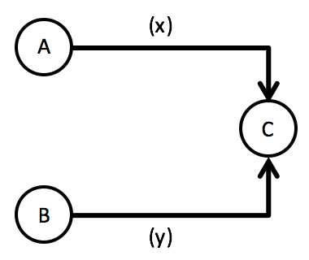

Like with outputs sometimes understanding the semantics of this is helped by adding labels to the input *ports*.

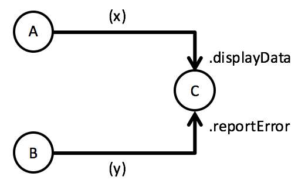

A flow drawn like this denotes independence of data flowing on the branches. The consuming functional unit will react whenever data on either branch arrives.

## Joining
If you want to make a consuming FU depend on the joint arrival of data from multiple branches put a *join* before it to compile the data:

|  	|   Explanation	|
|---	|---	|
|   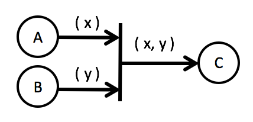   	|   The *join* assembles data from multiple branches into a tuple as its output.	|
|   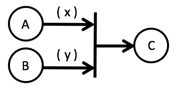   	|   Usually the output of the *join* is omitted.	|
|   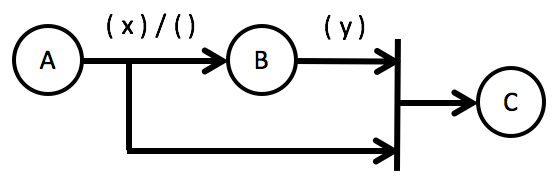   	|   Application of a *join* to assemble data from different stages of the data flow.	|
|   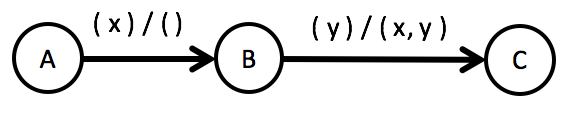   	|   Avoid parallel branches by using the `|` operator for data.	|

## Exceptions and Out-of-Band Data
"Special cases" during data processing in a flow - like invalid data - can be denoted by dedicated output *ports* and branches in the flow. An error message then is just some data flowing along.

But you can use exceptions, too - and still make that in your data flows explicit:

|  	|   Explanation	|
|---	|---	|
|   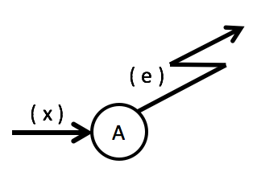   	|   Just a "lightning bolt" arrow to denote an exception flowing from some FU.	|
|   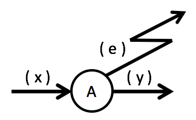   	|   The exception can be an alternative output from a FU.	|

However, exceptions are just a special case of out-of-band data, i.e. data not belonging to the main data processing flow.

A more general notation for out-of-band data is the following. Also use it, if several processing steps in da flow share the same "alternative output".

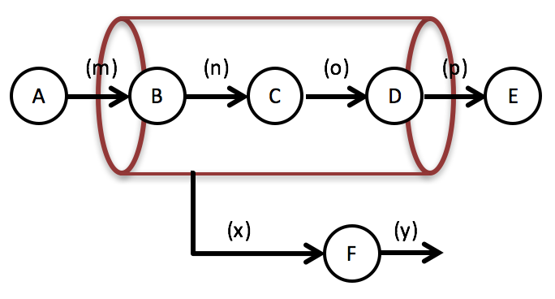

In this example `B`, `C`, and also `D` not only output data into the main flow (from `A` to `E`), but also have a second output *port* for *x* data items.

If you're familiar with Functional Programming you could think of the "tube" around the data flow as a *monad*.