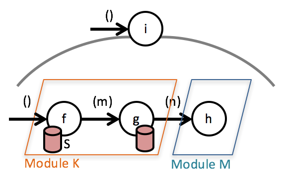

The most common dependency of functional units is state.



It's implementation is easy, though. Just gather the implementations of the functional units accessing it in the same class and make the state one of its fields:

```
class ModuleK {
  S s;
  
  public M f() {
    ...
    this.s = ...;
    ...
    return m;
  }
  
  public N g(M m) {
    var ... = this.s ...;
    ...
    this.s = ...;
    ...
    return n;
  }
}


class ModuleM {
  public static void h(N n) { ... }
}


void i() {
  var k = new ModuleK();
  var m = k.f();
  var n = k.g(m);
  ModuleM.h(n);
}
```

Note: Dependency on state or some API/resource is a hint to make functions for input *ports* non-static.