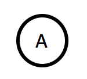

Function units (FU) are the workhorses in any flows of Flow-Design. Each FU stands for some transformation: input is transformed into output.

In its generic form a FU looks like this:

|  	|   Explanation	|
|---	|---	|
|   	|   The named shape stands for some (domain) logic with meaning _A_. Drawing a circle/an ellipse is easiest to capture a task/operation/stuff do be done.	|

If you just use "bubbles" for FUs you'll be fine. However, it has proven useful to use other shapes to denote specific kinds of transformations.

|  	|   Explanation	|
|---	|---	|
|   	|   A transformation accessing a resource (e.g file, database, TCP-connection).	|
|   	|   An alternative way to show resource access.	|
|   	|   A transformation which gets triggered by a user (or some other software in the environment). Use it to denote a UI (or API).	|

## Expressing Statefulness
You can think of functional units as objects. But don't equate them with the things which get instanciated from classes in your object-oriented language of choice. They are more like what [Alan Kay had in mind](http://userpage.fu-berlin.de/~ram/pub/pub_jf47ht81Ht/doc_kay_oop_en) when he coined the term in 1967:

> I thought of objects being like biological cells and/or individual computers on a network, only able to communicate with messages (so messaging came at the very beginning) [...] OOP to me means only messaging, local retention and protection and hiding of state-process, and extreme late-binding of all things.

In the end functional units will need to be translated into concrete textual programming language code, but they themselves are nothing like that. They are conceptual building blocks for software solutions.

As that they can be stateful like Alan Kay envisioned his cell-like objects. Functional units "are allowed" to hold local state, protect it, and hide its details. Think of them more as having data, not being data. Functional units are processors, not data structures. And if they need to keep state in order to do their transformation job that should be shown in a Flow-Design:

|  	|   Explanation	|
|---	|---	|
|   	|   A stateful functional unit. It reads and or writes in-memory state to span processing of several messages.	|
|   	|   If you like be precise and name the state. 	|
|   	|   Alternatively color the state to distinguish it from state other functional units keep.	|

Note that several functional units might share state. This is easiest to depict with colored state drums:

If a functional unit only reads from/writes to state and does nothing else, you can drop the "bubble" altogether and focus on the state:

|  	|   Explanation	|
|---	|---	|
|   	|   Just read from in-memory state.	|
|   	|   Just write to in-memory state. 	|