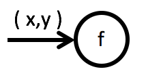

Implementing the input *port* of a functional unit is always done the same way.


You take the name of the functional unit and turn it into a function:

`... f(...) { ... }`

Whatever data is flowing into the functional unit becomes the parameters of the function:

|  	|   Explanation	|
|---	|---	|
|    	|   `...f(X x) {...}`	|
|    	|   `...f(X x, Y y) {...}`	|
|    	|   `...f(X[] x) {...}` or `...f(List<X> x) {...}`	|

Notice that the data flowing in these examples is written with small letters (e.g. `x`) and is assumed to be of a same named type written with a capital letter (e.g. `X`).

> When implementing an input *port* it's of no concern, whether the data is denoted as a stream (`(x)*`) or not (`(x)`). Always focus on a single data item.

## Classes for Functions
In some programming languages functions can only be defined inside a class.

If that's the case for your target language, then you need to assign your functional units to at least one level of modules, before you translate them into code.


Modules will be implemented as classes. Input *ports* will become functions inside these classes.

```
class ModuleA {
  ... f(X x) {...}
}
```

## Functional Units with Several Inputs
If a functional unit has several inputs they still are translated into functions - but how to name them?

Sometimes *overloading* will do the job. Both inputs are translated into same named functions with different parameter lists:

|  	|   Explanation	|
|---	|---	|
|    	|   `...f(X x) {...}` **and** `...f(Y y) {...}`	|

But usually the flow design should be more specific and distinguish the inputs with portnames. Then the portnames are used as function names - and the name of the functional unit could become the name of the class containing those functions:


```
class F {
  ... Calculate(X x) {...}
  ... Transform(Y y) {...}
}
```

Most likely you'll encounter multiple inputs only in data flow diagrams showing modules. Then it's clear how to name the container for the functions.