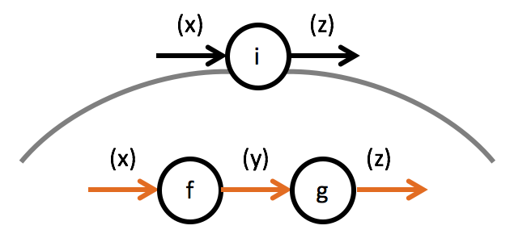
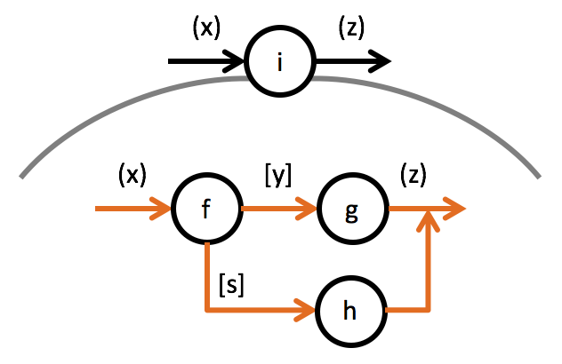
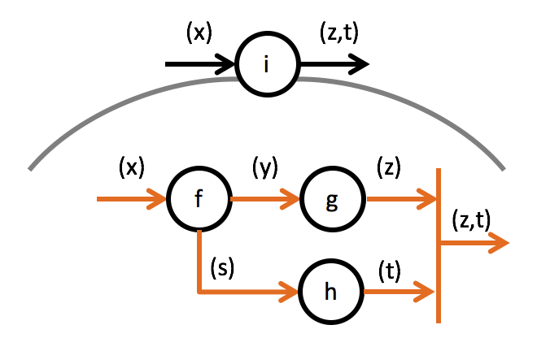
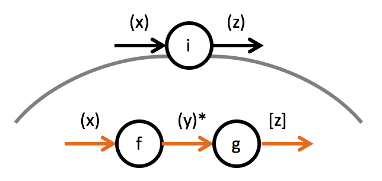
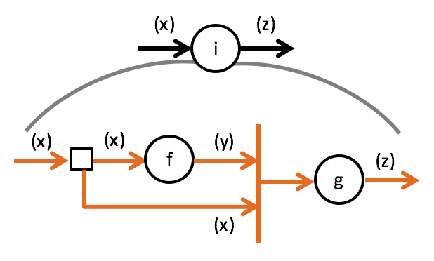
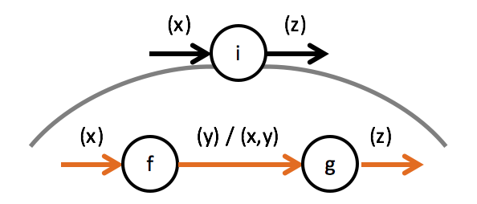
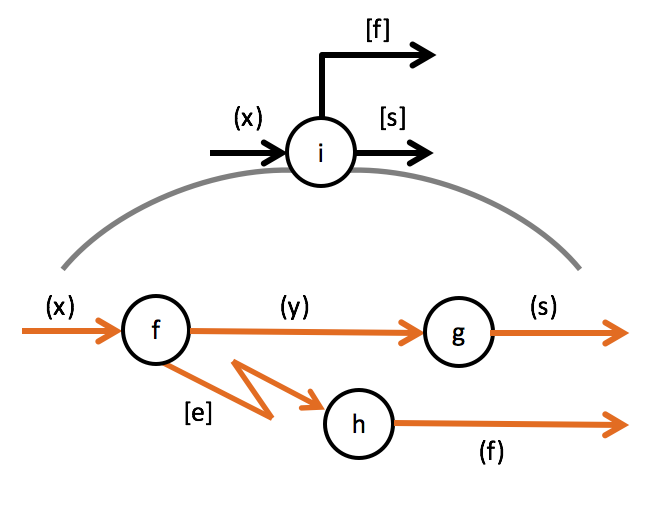

Integration is about the flow of data between functional units, it's about the arrows in flow designs:



There are many ways the connections between functional units can be implemented. But unless functional units are distributed across threads or processes or even machines it all boils down to simple functional calls.

The integration itself is just another functional unit. Its outer form thus is implemented by following the input/output *port* translation patterns, e.g.

```
Z i(X x) {
  ...;
  return z;
}
```

### Integrating Single Outputs
Internally this function needs to "wire-up" the functions for the functional units to integrate. As long as those function just produce single non-stream output that is simple, e.g.

```
Z i(X x) {
  var y = f(x);
  var z = g(y);
  return z;
}
```

Each input *port* function is called and its result is passed to the next input *port* function.

### Integrating Multiple Outputs
With multiple outputs the integration depends on the implementation (and sematics) of the *ports*:



In this example the output *ports* are meant to carry data in a mutually exclusive manner: either a `y` is produced or an `s`:

```
void f(X x, Action<Y> onY, Action<S> onS) {
  ...
}

Z g(Y y) { ... }

Z h(S s) { ... }


Z i(X x) {
  Z z;
  f(x,
    y => z = g(y),
    s => z = h(s));
  return z;
}
```

Notice how the continuations are passed in as lambda expressions.

In case the outputs are not optional, though, the implementation can look different:



```
void f(X x, out Y y, out S s) {
  ...
}

Z g(Y y) { ... }

Z h(S s) { ... }


(Z,T) i(X x) {
  f(x, 
    out Y y, 
    out S s);
  var z = g(y);
  var t = h(s);
  return (z,t);
}
```

Notice how in this case and the previous translation the outputs are put on separate lines and are indendent. This makes it easier to spot output *ports*.

### Integrating Streamed Output
If a stream is implemented using a continuation



the code looks similar to that for multiple outputs:

```
void f(X x, Action<Y> onY) {
  ...
}

void g(Y y, Action<Z> onZ) { ... }


Z i(X x) {
  Z z;
  f(x,
    y => g(y,
           result => z = result)
  );
  return z;
}
```

Note how `z` is a *none or once* output: it's only produced at the end of the stream of `y` data items. `g()` is called several times, but only once generates a `z`.

The above is a scenario which also could be translated in a different way. An iterator makes the integration easier to read compared to a continuation:

```
IEnumerable<Y> f(X x) {
  ...
}

Z g(IEnumerable<Y> ys) { 
  var z;
  foreach(var y in ys)
    ...
  return z;
}


Z i(X x) {
  var ys = f(x);
  var z = g(ys);
  return z;
}
```

## Integrating Splits
Splits (and joins) might seem complicated to implement, but mostly they are not.



This is due to the natural scope a function body is offering:

```
Y f(X x) { ... }

Z g(X x, Y y) { ... }


Z i(X x) {
  var y = f(x);
  var z = g(x, y);
  return z;
}
```

All data entering the integration function or being produced inside of it as outputs of functional units can be "reused" at any point (downstream) in the data flow implementation. `x` is an example for that in the above case.

Note how the simplicity of the implementation is easier to imaginge with a data flow without explicit split/join by using the `|` operator:




## Integrating Exceptions


Integrating exception output is straightforward. Use the exception handling facilitiy of your target language:

```
Y f(X x) { 
  ...
  if (...) throw new Exception(...);
  ...
  return y;
}

S g(Y y) { ... }

F h(Exception e) { ... }


Z i(X x, Action<S> onS, Action<F> onF) {
  try {
    var y = f(x);
    var s = g(y);
    onS(s);
  }
  catch(Exception e) {
    var f = h(e);
    onF(f);
  }
}
```