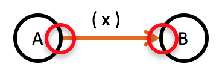

Implementing flow designs is about translating functional units and their relationships into code written in the programming language of your choice.

The question is: How do these "bubbles" look in Java (or C# or C++ or Ruby or Go etc.)?

Rest assured, translating data flow diagrams into code is straightforward, even if they don't look that simple anymore. And what's best: Given code that was "derived" from a flow design you can "reverse engineer" the diagram for it very easily. With some practice you'll learn "to see" the data flow in your code.

However, as natural the above question might sound, it's not really correct. The question is not, how to translate the "bubbles". Implementation is about the *ports* of the functional units and the arrow between functional units.

The explanation of how to implement flow designs thus will focus on each of these elements in turn.