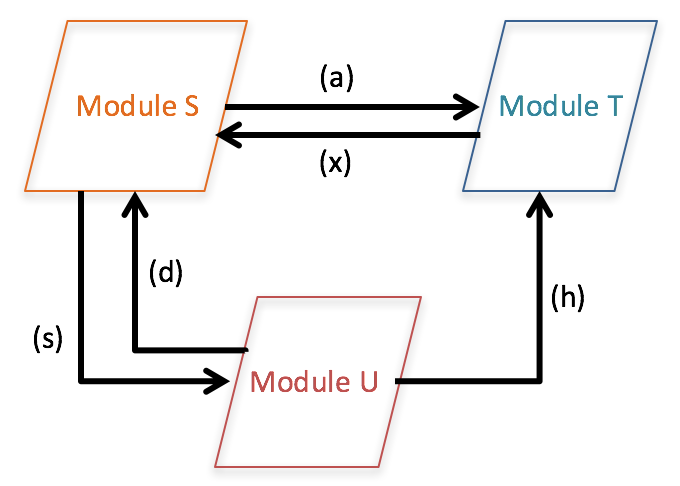

Functional units (FU) are "pieces of functionality". Composing data flows from FUs is about creating software behavior. The primary question flow designs answer is: How does a software create a specific effect in its environment?

To that effect functional units in data flows have to be different. The first one might read data, the next one processes the data, the final one writes data. Taken together these different responsibilities solve a problem.

The more data flows make up your software, the more functinonal units you come up with, the more you'll see patterns in them. Despite all the necessary difference of the FUs some will be more like others, some will be closer related to each other.

Such relationship is a matter of *purpose*. Closely related FUs serve the same purpose.

Purpose is yet another dimension of Flow-Design. It's orthogonal to the three "behavior-oriented" dimensions Transformation, Branching, and Abstraction.

To create order among a growing number of functional units you aggregate them according to their purpose. The means for doing so are *modules*.

In Flow-Design diagrams modules are not more than containers for FUs. But like functional units they later on need to be translated into code. That's when it's getting interesting: Enter classes!

As long as you're drawing data flows, though, don't concern yourself too much with such detail. Just look for common purposes among the FUs and make them clear in diagrams.

|  	|   Explanation	|
|---	|---	|
|   	|   You can use boxes around FUs to group them into modules.	|
|   	|   Of use colors to mark FUs of the same purpose.	|

Here are two examples of how that might look in real data flows. Both use boxes to denote modules:

If you think this looks messy don't worry. It made perfect sense to the developers who were present while the second data flow was developed.

The modules represented so far would be translated into classes. But you can continue Flow-Design on the module level. Modules can be connected by data flows as well:

However, as you can see in this example, how data actually flows to create an overall behavior is not obvious anymore. Specific functionality has been replaced by purposes.

Nevertheless sometimes it is illuminating to view "data production" from this angle.

As with integrations which bundle functional units you can bundle purposes on a yet higher level. Choose a shape to your liking to denote the higher level modules:

This works on as many levels as you like. It's creating ever more abstract purposes.

