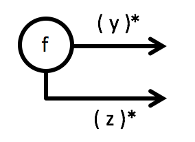

Implementing the output *port* of a functional unit is not as simple as implementing the input *port*.


There are two basic ways of doing it: returning output as the result of a function or passing output on by calling a continuation.

## Output as a Function's Result
Since input *ports* are always translated as functions there always is a function in you code to do what the functional unit is supposed to do.

Whatever the function produces as its output thus can simply be returned as the function result.

|  	|   Explanation	|
|---	|---	|
|    	|   `Y f(...) { ...; return y; }`	|
|    	|   `Y[] f(...) { ... }` or `List<Y> f(...) { ... }` or `IEnumerable<Y> f(...) { ... }`	|
|    	|   `(Y,Z) f(...) { ... }` or `Tuple<Y,Z> f(...) { ... }` or `YZType f(...) { ... }`	|

The simples way to produce output in the function of a functional unit is to call `return`. That way for a single "batch" of input data a single output value is passed on in the data flow.

## Output as a Continuation Call
As long a functional units only produce output once per input value they (or their pair of input/output *ports*) are easily translated into a function:


becomes

```
Y f(X x) { 
  ...; 
  return y; 
}
```

This implementation pattern perfectly fits the *Principle of Mutual Oblivion (PoMO)*: the function does not have any knowledge about where input is coming from or where output is going to. It's oblivious to its position within a data flow.

That's the beauty of functions - and at the same time their limitation. They cannot be used to implement functional units with several outputs


or ones which might not output anything at all


To implement one of several output *ports* or stream output `return` cannot be used to pass on output. Instead a function needs to be called with the output as its parameter. Such a function is called a *continuation* because is represents how data processing is to be continued.

### Multiple Output Ports


```
void f(..., Action<Y> onY, Action<Z> onZ) {
  ...; 
  onY(y); 
  ...
  onZ(z);
  ...
}
```

Notice two important aspects about the continuation functions:

* Their names do not tell anything about what will happen to the output data downstream in the data flow. That's important to stay true to the PoMO.
* The continuation functions do not return a value, they are procedures/`void`-functions. That, too, is important to stay true to the PoMO. A return value would be an assumption about downstream processing in disguise.

### Streamed Output


```
void f(..., Action<Y> onY) {
  ...; 
  onY(y); 
  ...
}
```

Notice how this implementation of streamed output can only be distinguished from a functional unit with several output *ports* by the number of continuations. Conversely that means a functional unit with several outputs will always be able to not produce any output at all or output multiple data items on its output *ports*. The following functional units thus will look the same in code:

 

  
 
Since the semantics of the second diagram are what's usually meant when drawing multiple outputs in a flow design you should make it a habit to add the `*` to the output data - unless the output really is not "of streamed nature".
 
#### Output as an Iterator
For a single streamed output *port* there is another option to translate it: an iterator.


```
IEnumerable<Y> f(...) {
  ...; 
  yield return y; 
  ...
}
```

This also allows the function not to return any data or multiple data items per input. However a consuming downstream function will be called in any case - even if there's no data to process by "pulling" on the iterator.

The more general implementation for streamed output is a continuation, though. It can be used with any number of output *ports*, it requires no specific handling on the consumer side, and it works across thread boundaries.

### Output as an Event
Continuations passed to a function as additional parameters are most versatile. They allow the function to be used in different contexts.

If functional units are not employed in different contexts, though, the continuations can be moved to their encompasing modules.


```
class ModuleA {
  public event Action<Y> OnY;
  
  void f(X x) {
    ...; 
    this.OnY(y);
    ...
  }
}
```

This implementation is often seen on classes gathering several functional units sharing the same output.