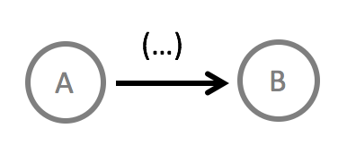
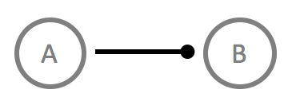

# Relationships between Functional Units
Functional units (FU) are the data processors in flow designs. The operate on input data and produce output data - sometimes while using in-memory state or a hardware resource.

In order to work together towards a common goal - some overall software behavior - FUs need to be connected, thus forming data flows and abstraction hierarchies.

The two fundamental relationships between FUs are:

|  	|   Explanation	|
|---	|---	|
|   	|   Data enclosed in `()` is flowing from the producer *A* to the consumer *B*.	|
|   	|   *A* depends on *B* for some service.	|

Note that in contrast to UML diagrams a dependency relationship is *not* denoted by an arrow. The arrow symbol is reserved for data flows.

In flow designs the most common relationship of course are data flows. This serves two purposes:

* *Decoupling*: Functional units in data flows are fundamentally decoupled, i.e. the do know not of each other and therefore do not rely on each other. They are independent and follow the *Principle of Mutual Oblivion (PoMO)*.
* *Explicit data*: Data in common software structure depictions like class diagram or flow charts is strangely absent. That leads to a neglect of designing the relationship of functional units to it. In Flow-Design the countermeasure is to focus on data with data flows and to always be specific about which data is flowing along a connection. For that purpose data should always be written next to the arrow enclosed in bracket.

#### Textual Notation
Although Flow-Design is about visualization of software structures on paper or whiteboards sometimes the need arises to describe a data flow using just text.

Although this is cumbersome it can be done:

* Use letters, words, phrases for functional units, e.g. `Split`, `Determine next player`.
* Use `>` or arrows `->` for data flow relationships. Include data using brackets, e.g. `-(sum, average)->`.
* Use `-*` to denote dependencies or use brackets attached to FUs, e.g. `Determine next player(game board)`.

In general feel free to invent your own textual language. Just stay true to the principles of Flow-Design and be clear and consistent. 

