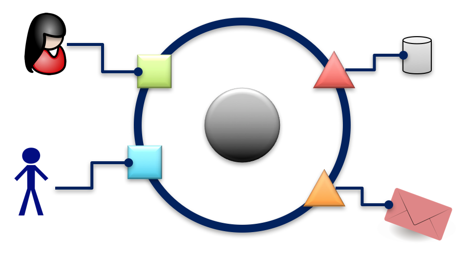
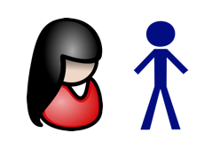
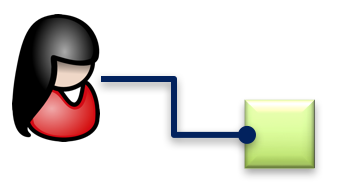
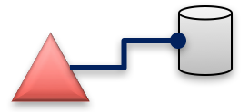
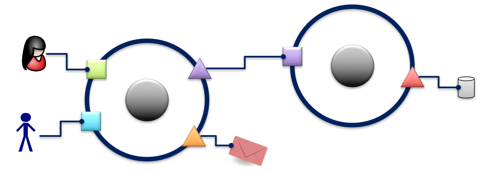

Data flows describe how behavior of software systems is created. It starts with input from the environment to the software system and end with output from the software system to the environment. Software systems are "I/O machines". They always were, they always will be - even in the age of smartphone apps.

Hence Flow-Design also makes suggestions as to how to depict whole software systems. It's even common practice to start your flow design with a sketch of the software system you're concerned with and then drill down into it "to find the flows" making it up.

Here's how a whole software system is drawn:

It's called a *system environment diagram* (or *software cell*). It somewhat resembles UML's [system context diagram](https://en.wikipedia.org/wiki/System_context_diagram) - but it's much simpler. The purpose is the same, though: show a system's relationships to the "outside world", i.e. everything relevant but not belonging to the system.

Each element in the system environment diagram has a specific meaning:

|  	|   Explanation	|
|---	|---	|
|   	|  First there is the system itself. It's separated from the environment by "a membrane" through which all communication flows. 	|
|   	|  Then there are actors in the environment. They work with the system. 	|
|   	|  Resources also are located in the environment. The system needs them for proper operation. 	|
|   	|  The domain on the other hand is located inside the system. It's the system's heart. 	|

The membrane is constituted by *adapters*. They facilitate the communication between "inhabitants" of the environment and whatever is inside the system.

|  	|   Explanation	|
|---	|---	|
|   	|  The adapters connecting any actors to the system are called *portals*. 	|
|   	|  The adapters connecting the system to any resources are called *providers*. 	|

Notice how the relationships between the environment and the adaperts are directed:

|  	|   Explanation	|
|---	|---	|
|   	|  Actors "talk" to portals. They trigger system behavior through portals. 	|
|   	|  Providers on the other hand talk to resource. They trigger them.	|

Data is of course flowing in both directions between environment and adapters!

The shapes for portals and providers are as drawn here. But how you draw actors and resources is up to you. The the default is something like a stick figure for actors and a drum for resources. But if you like become creative and make the environment more colorful and tangible.

## Hierarchical Software Systems
Larger software systems are made up of several software cells, each representing an autonomous sub-system like an application or client or server.

Flow-Design in this case speaks of "dividing software cells". This can be done "horizontally" to serve technical purposes. A client-server division would be the result of such a division. Or they can be divided "vertically" to serve productivity purposes. Vertically divided software cells represent "requirement slices" or increments. Setting an accounting application apart from a reporting application would be an example for this.

When dividing software cells they become part of each other's environment and are connect by provider-adapter pairs:

This is an example for a client-server architecture. Notice how the singe software cell from the beginning of this chapter has been divided horizontally: both actors now communicate with the client, which in turn uses the server to access the database (drum).
