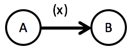
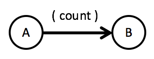
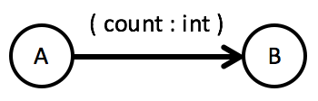
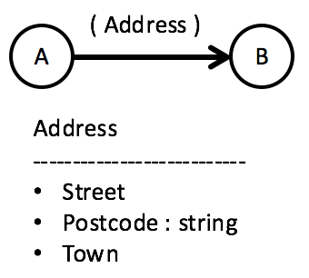
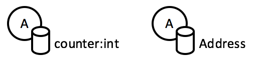

To describe the data flowing in a Flow Design just put some name between the brackets next to the arrow, like `x` in this example:

The default convention is: If the name of the data item starts with a lower case letter, it describes the content of the data, e.g. `sum`, `coordinates`, `filename`. The name then is about the meaning of the data within the context of the data flow.

In this case the type of the data is assumed to be a primitive type (e.g. integer, string, boolean) and obvious (or of little importance) to a reader of the data flow.

You'll probably follow this convention in most cases. But sometimes you want to or need to be more precise:

|  	|   Explanation	|
|---	|---	|
|   	|  `count` will be translated to an "obvious" primitive data type like `int` or `long`. 	|
|   	|  `count` will be translated to data type specified. The explicit data type is written after the data item name for convenience sake. While designing at a flip chart or whiteboard you mostly think of the meaning of data first, then of its exact type. 	|
|   	|  A capital letter at the beginning of the data item name denotes a custom data type (which at the same time works as the data description in this case; but you can also give it an explicit name, e.g. `(deliveryAddress:Address`). The first time you're using a custom data type be sure to add a data type description to your Flow Design. This can be done with a small table like shown. 	|

The same conventions of course apply to state data of function units, e.g.

